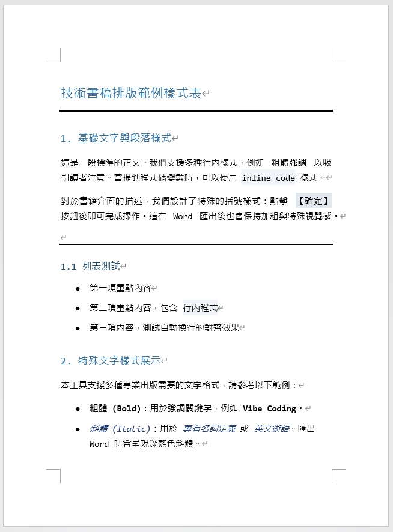
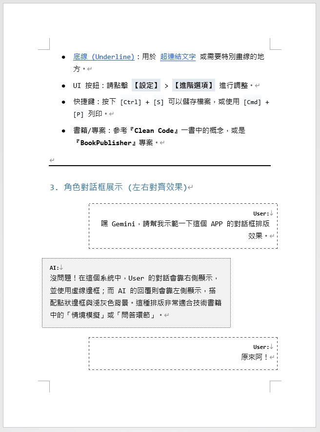
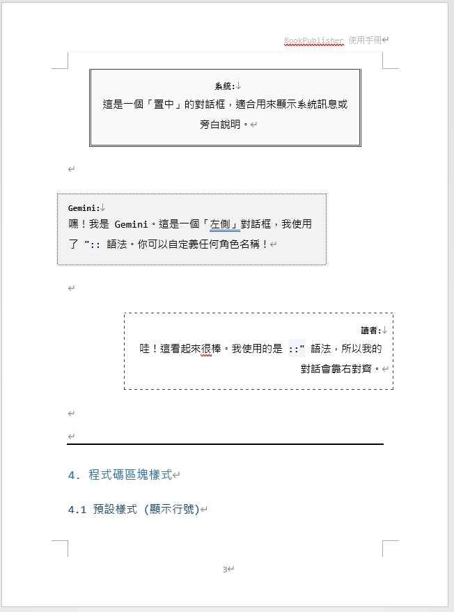
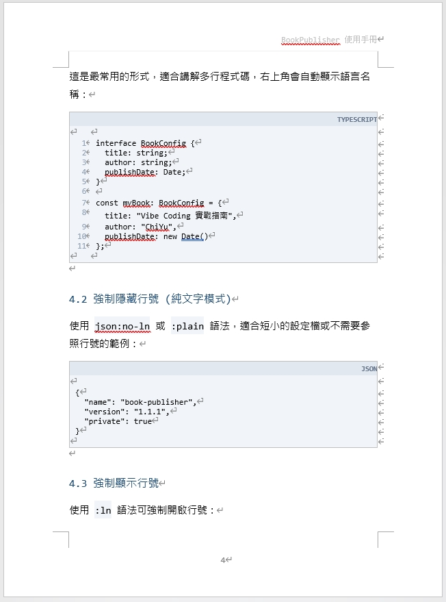
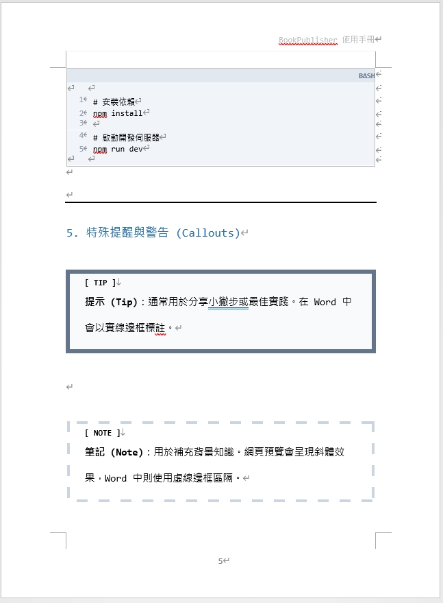
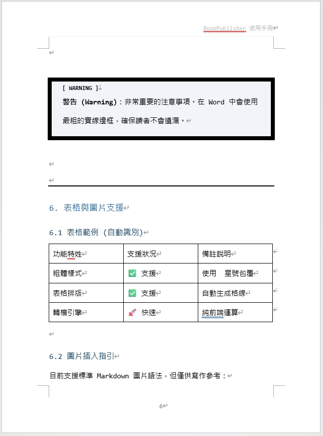

# MD2DOC-Evolution | v1.4.0

[](https://opensource.org/licenses/MIT)
[](https://github.com/eric861129/MD2DOC-Evolution)
[](https://github.com/eric861129/MD2DOC-Evolution/actions/workflows/ci.yml)

[中文](README.md) | [English](README_EN.md)


MD2DOC-Evolution 是一個開源的 Markdown 到 Word DOCX 技術書稿工作台，專為技術書作者、工程師與內容創作者設計。它把工程師熟悉的 Markdown 寫作流程，轉成出版社、審稿或交付常用的 Word 書稿格式。

線上試用：[https://huangchiyu.com/MD2DOC-Evolution/](https://huangchiyu.com/MD2DOC-Evolution/)

## v1.4.0 Highlights

- 專業工具台 UI：上方 command bar、左側 Markdown 快速鍵、中間 editor、右側 Word print preview。
- 更穩定的工具鏈：Tailwind 改為 Vite plugin、Buffer 改為 npm polyfill、GSAP 改為正式依賴。
- 共用 command model：左側快速鍵與 slash command 使用同一份指令資料。
- Registry-style preview renderer：Preview renderer 與 DOCX builder 的擴充方向一致。
- AI Agent Prompt：Header 內建 prompt 會附上 GitHub repo，讓外部 AI Agent 更容易產出符合格式的 Markdown。
- 匯出前狀態提示：顯示字數、block 數、Frontmatter 狀態與 DOCX 匯出狀態。
- Mobile editor/preview tabs：行動版不再擠壓左右分欄。

## Supported Syntax

| 功能 | 語法 | 說明 |
| :--- | :--- | :--- |
| Frontmatter | `---` YAML block | 支援 `title`、`author`、`header`、`footer` 等 metadata |
| 目錄 | `[TOC]` | 可產生 Word 目錄區塊 |
| 標題 | `#` 到 `###` | 對應 H1 到 H3 |
| 程式碼 | <code>```ts:ln</code> / <code>```json:no-ln</code> | 支援語言標籤與行號開關 |
| Mermaid | <code>```mermaid</code> | Preview 與 DOCX 匯出支援圖表 |
| Callout | `> [!NOTE]` / `> [!TIP]` / `> [!WARNING]` | 支援提示、筆記、警告區塊 |
| 對話 | `User "::` / `AI ::"` / `System :":` | 支援左、右、置中對話泡泡 |
| 表格 | Markdown table | 匯出成 Word 表格 |
| 圖片 | `` | 支援拖放圖片與 Markdown 圖片語法 |
| 連結 | `[text](url)` | 匯出時可附 QR Code |

## AI Assisted Generation

如果你要把既有筆記、逐字稿或草稿轉成 MD2DOC-Evolution 格式，可以點擊 Header 的 AI Prompt 按鈕，複製內建提示詞給 ChatGPT、Claude 或其他 AI Agent。

內建 prompt 會提供：

- GitHub repo 參考連結：`https://github.com/eric861129/MD2DOC-Evolution`
- Frontmatter、TOC、標題、code block、callout、table、dialogue 的格式要求
- 「只輸出 Markdown 原稿」的輸出契約
- 轉換前的 silent quality check

完整規格可參考：[AI Generation Guide](docs/AI_GENERATION_GUIDE.md)

## Documentation

- [Project Overview](docs/PROJECT_OVERVIEW.md)：設計哲學與核心功能。
- [AI Generation Guide](docs/AI_GENERATION_GUIDE.md)：給 AI Agent 與使用者的格式轉換規則。
- [Architecture](docs/ARCHITECTURE.md)：技術棧、目錄結構與核心工作流。
- [Development Guide](docs/DEVELOPMENT_GUIDE.md)：開發環境、測試與除錯技巧。
- [Customization](CUSTOMIZATION.md)：版面、樣式與輸出格式調整方式。

## Sample Output

範例 Word 文件：

- [下載範例文件](samples/範例Word.docx)

<div align="center">
  
  
  <br/>
  
  
  <br/>
  
  
</div>

## Getting Started

### Requirements

- Node.js 20+
- npm

### Local Development

```bash
git clone https://github.com/eric861129/MD2DOC-Evolution.git
cd MD2DOC-Evolution
npm install
npm run dev
```

本機開發站台：

```text
http://localhost:3000/MD2DOC-Evolution/
```

## Verification

```bash
npm run typecheck
npm run test:run
npm run build
npm run verify
```

`npm run verify` 會依序執行 typecheck、unit/component tests 與 production build，GitHub Actions 也使用同一組驗證流程。

## Tech Stack

- React 19
- TypeScript
- Vite 6
- Tailwind CSS via `@tailwindcss/vite`
- docx
- Mermaid
- Vitest + Testing Library

## Contributing

歡迎 issue、建議與 PR。此專案目前保留 branch flow 規則：

- `main` 只接受 `dev` 或 `hotfix/*`
- `dev` 接受 `dev_feature_*`、`dev_refactor_*`、`dev_hotfix_*` 或 `hotfix/*`

送出 PR 前請先執行：

```bash
npm run verify
```

## License

MIT License. See [LICENSE](LICENSE) for details.
