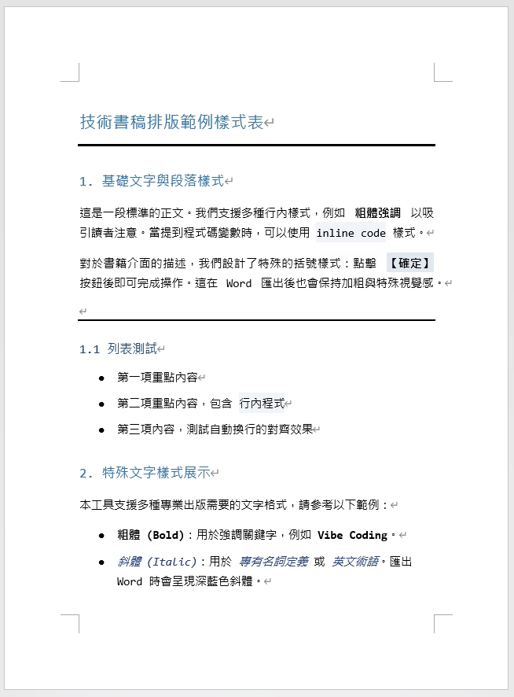
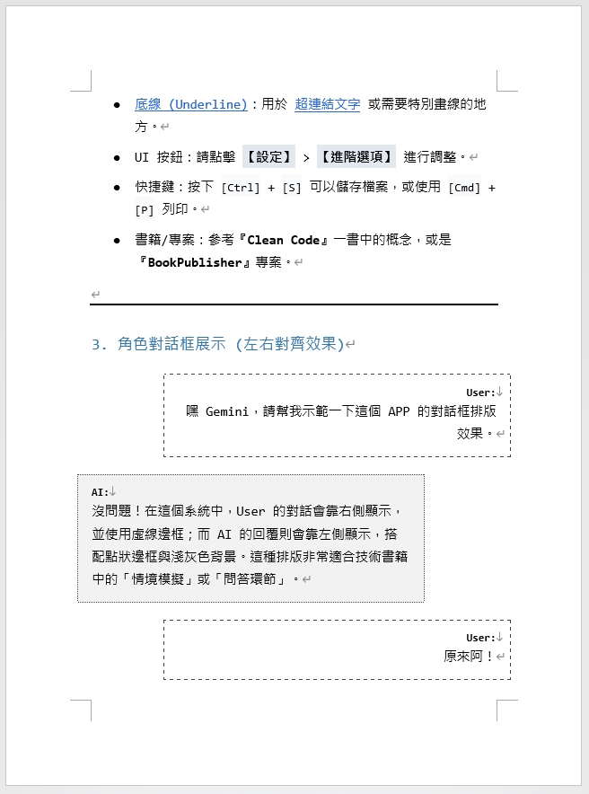
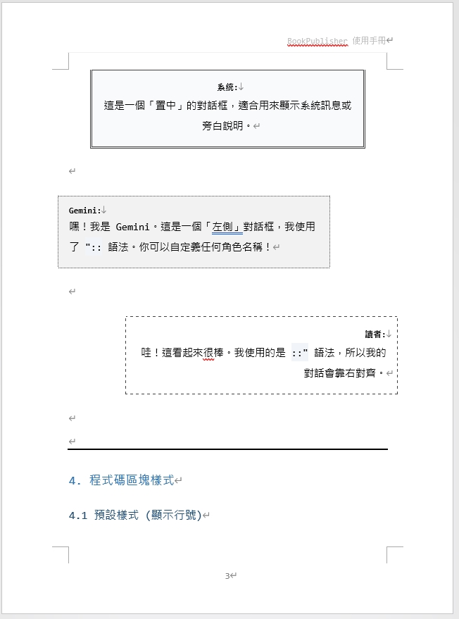
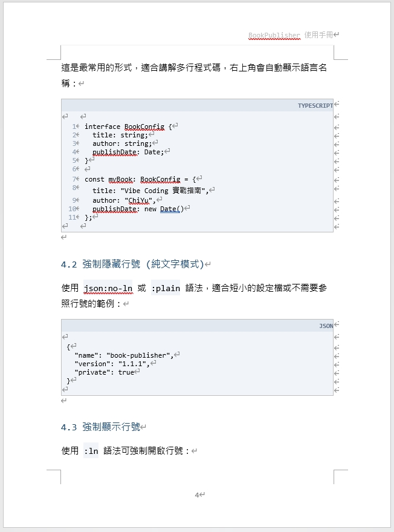
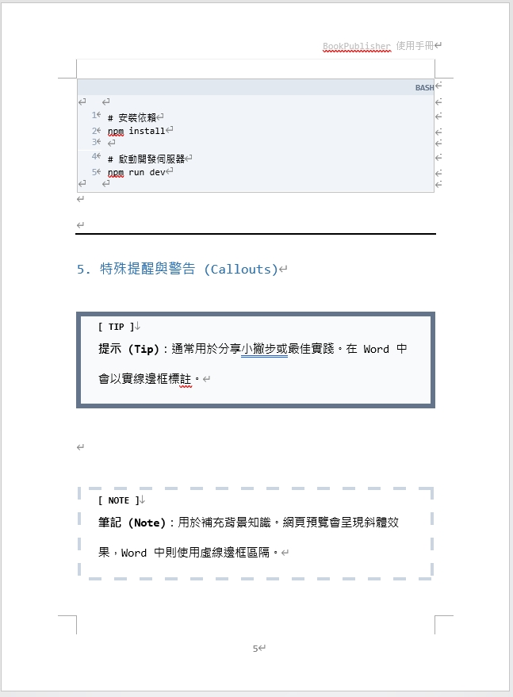
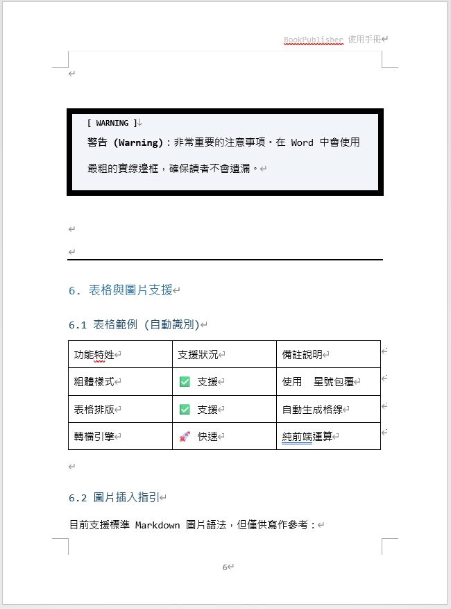

# MD2DOC-Evolution | v1.5.0

[](https://opensource.org/licenses/MIT)
[](https://github.com/eric861129/MD2DOC-Evolution)
[](https://github.com/eric861129/MD2DOC-Evolution/actions/workflows/ci.yml)

[中文](README.md) | [English](README_EN.md)


MD2DOC-Evolution is an open-source Markdown-to-Word DOCX manuscript workspace for technical book authors, engineers, and professional content creators. It keeps the writing flow close to Markdown while producing Word manuscripts suitable for review, publishing, and handoff.

Live demo: [https://huangchiyu.com/MD2DOC-Evolution/](https://huangchiyu.com/MD2DOC-Evolution/)

## v1.5.0 Highlights

- Paper and margins: 17 × 23 cm, A4, A5, B5, custom paper, and reusable or custom margin presets.
- Publisher profiles: `publisher-exact`, `publisher-narrow`, and `publisher-binding`, while `technical-legacy` remains the default.
- Binding layout: mirrored inside/outside margins and gutter support.
- Publishing syntax: `[CHAPTER]`, explicit `[QR:label](URL)`, plus `IMPORTANT` and `CAUTION` callouts.
- Word structure: named publisher styles, fixed table geometry, updateable TOC fields, and chapter bookmarks.
- OOXML QA: package, relationship, media, and content-type inspection, with a public LibreOffice/Poppler visual regression fixture.

The existing professional workspace UI, shared command model, AI Agent Prompt, and mobile editor/preview flow remain compatible.

## Supported Syntax

| Feature | Syntax | Notes |
| :--- | :--- | :--- |
| Frontmatter | `---` YAML block | Supports `title`, `author`, `header`, `footer`, and other metadata |
| Table of contents | `[TOC]` | Creates a Word-style TOC block |
| Chapter opener | `[CHAPTER]` YAML block | Chapter number, title, summary, image, and goals |
| Headings | `#` to `###` | Maps to H1 through H3 |
| Code blocks | <code>```ts:ln</code> / <code>```json:no-ln</code> | Supports language labels and line-number flags |
| Mermaid | <code>```mermaid</code> | Supported in preview and DOCX export |
| Callouts | `NOTE` / `TIP` / `WARNING` / `IMPORTANT` / `CAUTION` | Five publishing callout types |
| Dialogue | `User "::` / `AI ::"` / `System :":` | Left, right, and centered dialogue bubbles |
| Tables | Markdown table | Exported as Word tables |
| Images | `` | Supports dropped images and Markdown image syntax |
| Links | `[text](url)` | Remains a normal hyperlink |
| Explicit QR | `[QR:label](URL)` | Creates a QR block only for important print links |

## AI Assisted Generation

To convert existing notes, transcripts, or drafts into MD2DOC-Evolution format, click the AI Prompt button in the header and paste the prompt into ChatGPT, Claude, or another AI agent.

The built-in prompt includes:

- GitHub repo reference: `https://github.com/eric861129/MD2DOC-Evolution`
- Required formatting for Frontmatter, TOC, headings, code blocks, callouts, tables, and dialogue
- An output contract that asks the agent to return only the converted Markdown manuscript
- A silent quality check before the agent answers

See the full rules in [AI Generation Guide](docs/AI_GENERATION_GUIDE.md).

## Documentation

- [Project Overview](docs/PROJECT_OVERVIEW.md): design philosophy and core features.
- [AI Generation Guide](docs/AI_GENERATION_GUIDE.md): conversion rules for users and AI agents.
- [Publisher Profile](docs/PUBLISHER_PROFILE.md): paper, margins, binding, profiles, and publishing syntax.
- [Architecture](docs/ARCHITECTURE.md): tech stack, directory structure, and core workflows.
- [Development Guide](docs/DEVELOPMENT_GUIDE.md): local setup, testing, and debugging.
- [Customization](CUSTOMIZATION.md): layout, styling, and export customization.

## Sample Output

Sample Word document:

- [Download sample DOCX](samples/範例Word.docx)

<div align="center">
  
  
  <br/>
  
  
  <br/>
  
  
</div>

## Getting Started

### Requirements

- Node.js 20+
- npm

### Local Development

```bash
git clone https://github.com/eric861129/MD2DOC-Evolution.git
cd MD2DOC-Evolution
npm install
npm run dev
```

Local dev URL:

```text
http://localhost:3000/MD2DOC-Evolution/
```

## Verification

```bash
npm run typecheck
npm run test:run
npm run build
npm run verify
```

`npm run verify` runs type checking, unit/component tests, and the production build. GitHub Actions uses the same verification flow.

## Tech Stack

- React 19
- TypeScript
- Vite 6
- Tailwind CSS via `@tailwindcss/vite`
- docx
- Mermaid
- Vitest + Testing Library

## Contributing

Issues, suggestions, and pull requests are welcome. The repository currently keeps the branch flow rules:

- `main` accepts `dev` or `hotfix/*`
- `dev` accepts `dev_feature_*`, `dev_refactor_*`, `dev_hotfix_*`, or `hotfix/*`

Before opening a PR, run:

```bash
npm run verify
```

## License

MIT License. See [LICENSE](LICENSE) for details.
