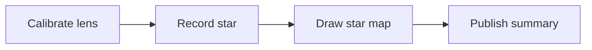

[TOC]

[CHAPTER]
number: "01"
part: "Part One: Build the Observatory"
title: "Light the First Star Map"
englishTitle: "Light the First Star Map"
summary: "The Star Map Workshop uses an entirely fictional observation workflow to demonstrate chapter openers, images, goals, and publisher layouts."
image: "fixture-generated-image"
goals:
  - "Identify the inputs and outputs of an observation."
  - "Complete a repeatable star-map publishing workflow."
[/CHAPTER]

# Star Map Workshop Observation Guide

This [MD2DOC-Evolution](https://github.com/eric861129/MD2DOC-Evolution) manuscript works with `technical-legacy`, `publisher-exact`, `publisher-narrow`, or `publisher-binding`. The exact profile uses 2.10 cm vertical and 2.30 cm horizontal margins; choose the narrow profile for a wider content area.

This paragraph contains an **important observation rule**, an *italic term*, <u>underlined review text</u>, the `star-map --calibrate` inline command, a [Ctrl] key label, and a [public observation guide](https://example.com/starmap-workshop/guide).

## Prepare the observation equipment

### Calibrate the lens and clock

- Check the northern positioning scale
- Record the observation time
- Confirm the star-map sheet number

1. Start the fictional observatory
2. Load the Star Map Workshop test data
3. Export the public observation summary

- [ ] Review publisher page breaks
- [x] Confirm the paper and margin settings

> This ordinary quotation preserves the observer's original note.

---

> [!NOTE]
> Note: retain the calibration time for every observation.

> [!TIP]
> Tip: use a low-power lens to locate the brightest test star first.

> [!WARNING]
> Warning: pause automatic recognition when the cloud cover is too heavy.

> [!IMPORTANT]
> Important: public reports must use only fictional Star Map Workshop data.

> [!CAUTION]
> Caution: save the current coordinates before changing lenses.

## Character dialogue

Observer ":: I found the northern test star.
Calibration assistant ::" Record its brightness as level seven.
Console :": The Star Map Workshop sequence is ready.

## Data tables

| ID | Star | Direction | Altitude | Brightness | Status |
| :--- | :--- | :--- | :--- | :--- | :--- |
| S-05 | South Light | South | 28° | Level 3 | Tracking |

## Code, image, and QR

```typescript:ln
type Observation = {
  starId: string;
  brightness: number;
};

const observation: Observation = {
  starId: "S-05",
  brightness: 3,
};
```


[QR:Star Map Workshop public page](https://example.com/starmap-workshop)

## Mermaid observation flow



### Finish the observation

The public test is complete. This final paragraph verifies long-document paragraph spacing and footer placement.
