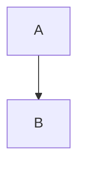

# AI Generation & Conversion Guide (AI 輔助生成與轉換指南)

本文件旨在提供給大型語言模型 (LLM, 如 ChatGPT, Claude, Gemini) 閱讀，以便精確地將現有的內容或 Markdown 檔案轉換為 **MD2DOC-Evolution** 所支援的專屬格式。

---

## 1. 文件後設資料 (YAML Frontmatter)
所有文件必須以 YAML 開頭，定義書籍的基本屬性：

```yaml
---
title: "您的書籍名稱"
author: "作者姓名"
header: true
footer: true
---
```

## 2. 自動目錄 (TOC)
在文件開頭（Frontmatter 之後）插入 `[TOC]` 標籤以生成 Word 原生目錄。

## 3. 標題層級 (Headings)
請使用標準 Markdown 標題，最多支援至三級：
- `# H1` -> Word 第一級標題
- `## H2` -> Word 第二級標題
- `### H3` -> Word 第三級標題

## 4. 增強型程式碼區塊 (Code Blocks)
必須指定語言，並可選擇性控制行號：
- ` ```typescript ` (預設顯示行號)
- ` ```python:no-ln ` (強制隱藏行號)
- ` ```bash:ln ` (強制顯示行號)

## 5. 提示區塊 (Callouts)
使用引用語法並配合特定的標籤：
- `> [!TIP]`：提示、技巧、最佳實踐。
- `> [!NOTE]`：補充筆記、背景知識。
- `> [!WARNING]`：警告、重要注意事項。

## 6. 角色對話框 (Chat Dialogues)
用於模擬對話場景，語法如下：
- **左側對話**：`角色名稱 ":: 對話內容`
- **右側對話**：`對話內容 ::" 角色名稱`
- **中央對話**：`角色名稱 :": 對話內容` (適合系統訊息)

## 7. 特殊行內樣式 (Inline Styles)
請在適當內容套用以下自訂符號：
- **UI 按鈕**：使用粗角括號 `【按鈕文字】`。
- **鍵盤按鍵**：使用方括號 `[Ctrl]`。
- **書籍/專案名稱**：使用書名號 `『Clean Code』`。
- **智慧連結**：標準連結 `[文字](URL)` 會在 Word 匯出時自動附帶 QR Code。

## 8. Mermaid 圖表
支援標準 Mermaid 語法，例如：


---

## AI 轉換指令 (AI System Prompt)

**請將以下 Prompt 提供給您的 AI 助理：**

> 你現在是一位專業的技術書籍編輯，負責將我的 Markdown 原始稿件轉換為「MD2DOC-Evolution」專用的格式。
> 
> 請遵循以下規則進行轉換：
> 1. 加入正確的 YAML Frontmatter (包含 title, author)。
> 2. 在開頭插入 `[TOC]`。
> 3. 將所有的提示訊息轉換為 `> [!TIP]`、`> [!NOTE]` 或 `> [!WARNING]` 格式。
> 4. 檢查所有的程式碼區塊，確保有指定語言標籤。
> 5. 將對話內容轉換為角色對話框語法 (`"::` 或 `::"`)。
> 6. 將 UI 操作、按鈕、快捷鍵與書名套用正確的行內樣式 (如 `【】`, `[]`, `『』`)。
> 7. 確保所有連結都維持標準 Markdown 格式以便生成 QR Code。
> 
> 待轉換的內容如下：
> [在此貼上您的內容]
