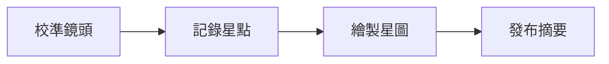

[TOC]

[CHAPTER]
number: "01"
part: "第一部：建立觀測站"
title: "點亮第一張星圖"
englishTitle: "Lighting the First Star Map"
summary: "星圖工坊準備了一套虛構的觀測流程，用來確認出版社版型中的章首頁、圖片與學習目標。"
image: "fixture-generated-image"
goals:
  - "辨識觀測資料的輸入與輸出。"
  - "完成可重複驗證的星圖發佈流程。"
[/CHAPTER]

# 星圖工坊觀測指南

這是一段一般文字，包含**重要觀測原則**、`star-map --calibrate` 行內程式碼，以及[公開觀測說明](https://example.com/starmap-workshop/guide)。

## 準備觀測器材

### 校準鏡頭與時鐘

- 檢查北方定位刻度
- 記錄觀測時間
- 確認星圖紙張編號

1. 啟動虛構觀測台
2. 載入星圖工坊測試資料
3. 匯出公開觀測摘要

> [!NOTE]
> 筆記：每次觀測都要保留校準時間。

> [!TIP]
> 提示：先用低倍率鏡頭尋找最亮的測試星。

> [!WARNING]
> 警告：雲層過厚時，請暫停自動辨識。

> [!IMPORTANT]
> 重要：公開報告只能使用星圖工坊的虛構資料。

> [!CAUTION]
> 注意：切換鏡頭前要先保存目前的觀測座標。

觀測員 ":: 我已經找到北方測試星。
校準助手 ::" 請把亮度記錄為七級。
中控台 :": 星圖工坊觀測序列已就緒。

## 一至六欄資料表

| 一欄 |
| :--- |
| 星點 |

| 編號 | 星名 |
| :--- | :--- |
| S-01 | 晨光 |

| 編號 | 方位 | 亮度 |
| :--- | :--- | :--- |
| S-02 | 東北 | 六級 |

| 編號 | 方位 | 高度 | 亮度 |
| :--- | :--- | :--- | :--- |
| S-03 | 正東 | 42° | 五級 |

| 編號 | 方位 | 高度 | 亮度 | 狀態 |
| :--- | :--- | :--- | :--- | :--- |
| S-04 | 東南 | 35° | 四級 | 穩定 |

| 編號 | 方位 | 高度 | 亮度 | 狀態 | 備註 |
| :--- | :--- | :--- | :--- | :--- | :--- |
| S-05 | 正南 | 28° | 三級 | 追蹤中 | 虛構資料 |

## 程式碼與圖片

```ts showLineNumbers
type Observation = {
  starId: string;
  brightness: number;
};

const observation: Observation = {
  starId: 'S-05',
  brightness: 3,
};
```


[QR:星圖工坊公開頁面](https://example.com/starmap-workshop)

## Mermaid 觀測流程



### 完成觀測

星圖工坊的公開測試到此完成；這段結語用來檢查長文末端的段落間距與頁尾位置。
